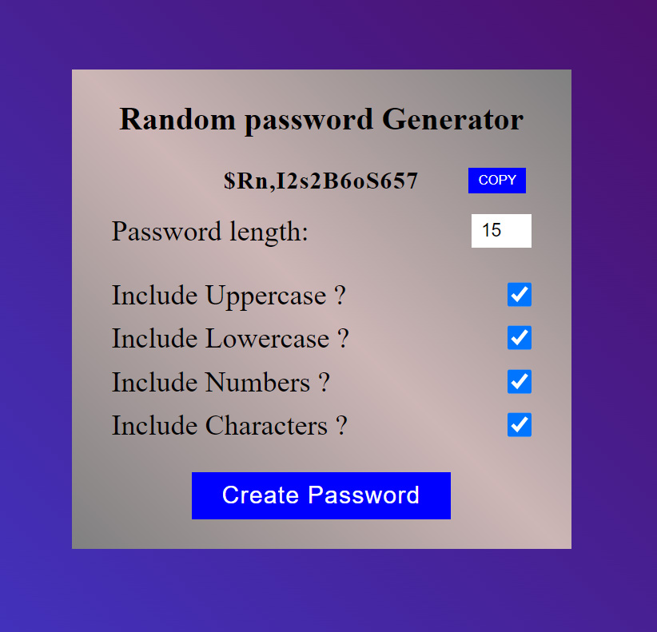

# Password Generator

This is a simple web application that allows users to generate secure passwords based on their preferences. The generated passwords can include a mix of lowercase letters, uppercase letters, numbers, and symbols.

[Try online](https://narekhar666.github.io/Password-Generator/) or clone the repository to your local machine.

## Features

- Password length customization (between 8 and 15 characters).
- Checkbox options for including lowercase letters, uppercase letters, numbers, and symbols.
- Password randomness is ensured through shuffling selected character types.
- Copy to clipboard functionality for easy use.
- Fully responsive

## Usage

1. Open the [live demo](https://narekhar666.github.io/Password-Generator/) or clone the repository to your local machine.
2. Open `index.html` in a web browser.
3. Adjust the password length using the input field.
4. Select the character types you want to include in the password.
5. Click the "Create Password" button to generate a password.
6. Optionally, click the "COPY" button to copy the generated password to the clipboard.

## How it Works

- The application uses JavaScript to generate random characters based on the selected options.
- The `generatePassword` function ensures at least one character from each selected checkbox type is included.
- Password randomness is achieved through shuffling both the `charactersArray` and the generated password.
